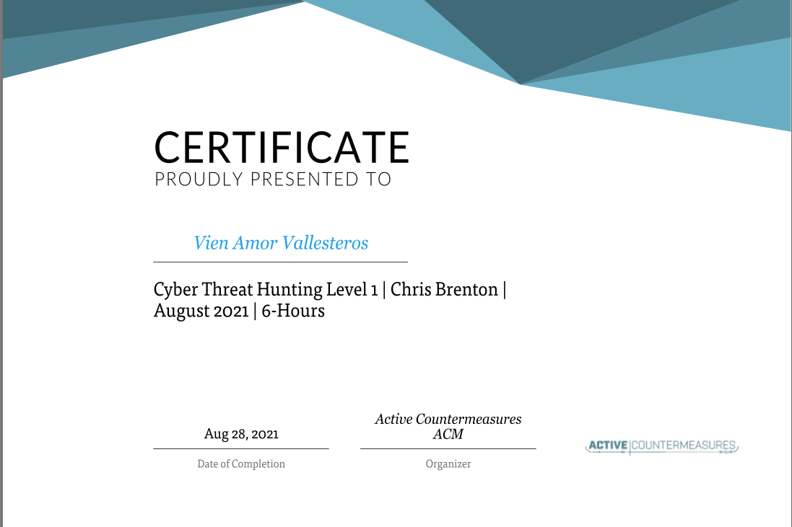

# Final Notes & Certification

Overall this Chris and the ACM team really know how to teach a course. Chris provided the lecture, then he went through his process of how to do it, and provided hints that helped those of us who are new to Threat Hunting. I would adhere to Chris's methodology of teaching because its effective. \
\
Threat hunting is somewhere I personally want to get my foot in, therefore taking up his free class at 5am in the morning still wouldn't stop me!

