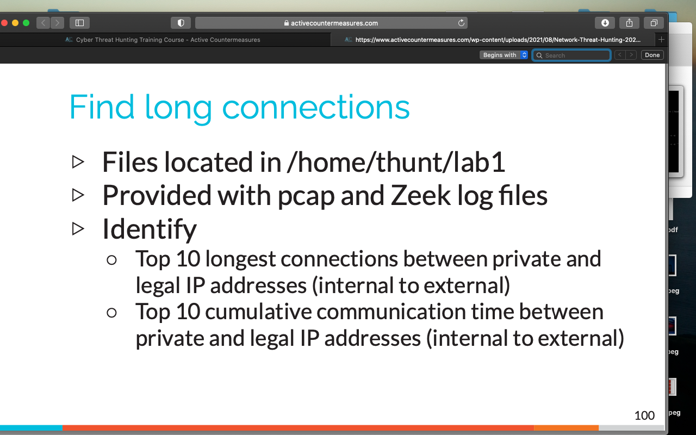
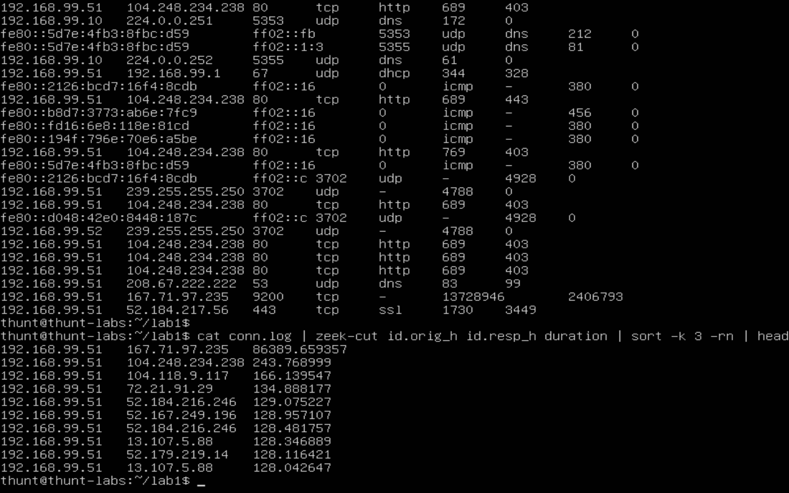
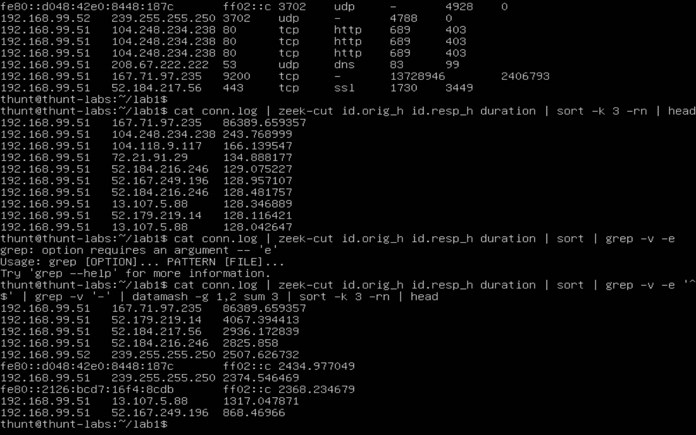
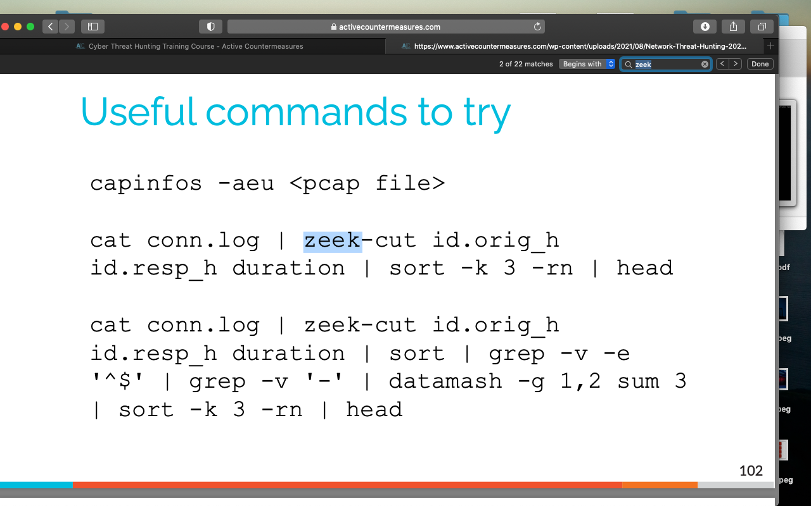

# Exercise 1

We begin to use zeek in this exercise and practice using sorting and grep tools.&#x20;

This next input helps us categorize the information from zeek. These are first two IPs are IP pairs, and the last section is the amount of seconds those two IPs have interacted in 24 hours. \
&#x20;_\*FYI 24hrs = 86400seconds_

Also have the Discord Chat opened up to help people if they get stuck.

Exercise 1 done, onto the next!

