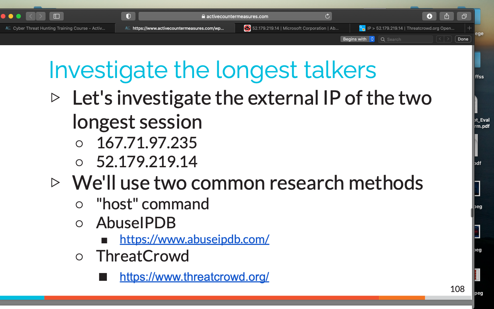
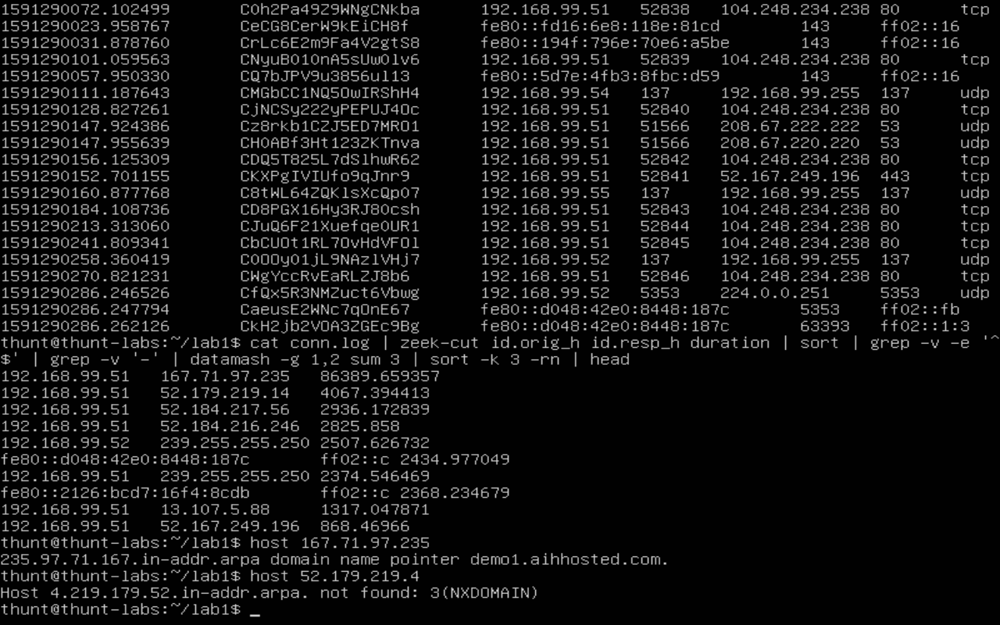
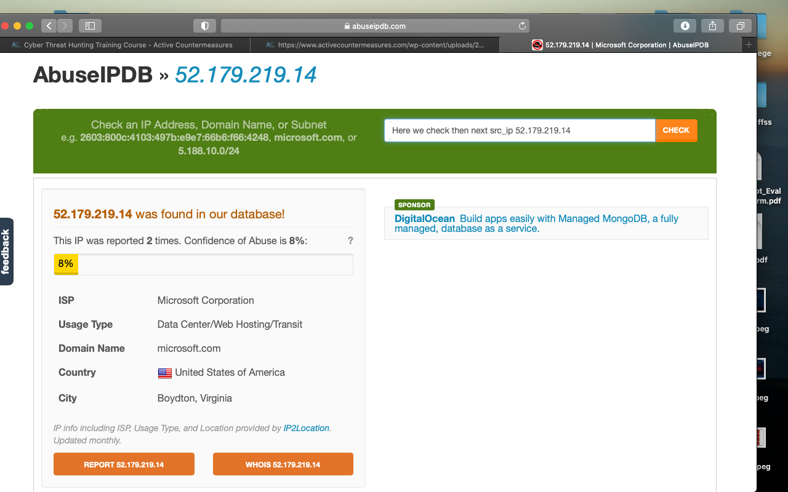
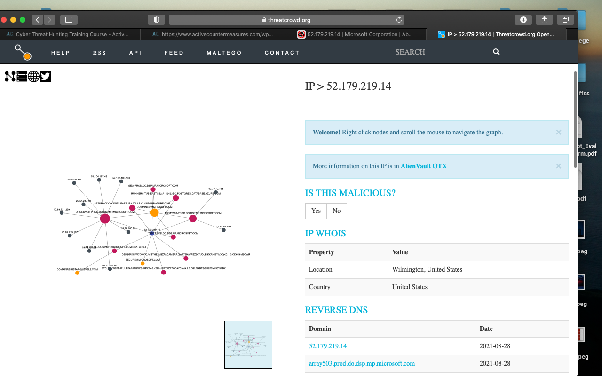

# Exercise 2

Using data mash to sort out the columns and seconds

We follow the IP's to make sure they are actual domains. A few safety warnings came up while proceeding on chrome, but I trust the ACM team.

Next we find the other IP address through AbuseIPDB to see where its coming from and who is host.

Then we see where it's connected.

