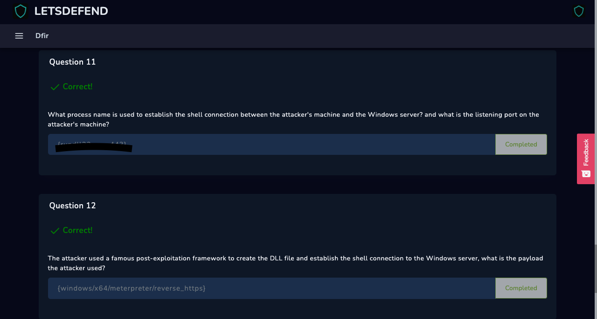
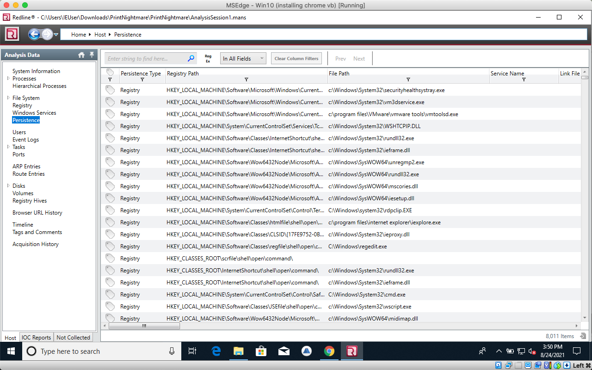

# 11th/12 Questions

### Eleventh

This is a very common .exe that some may find recognizable. For this step we go back to Redline and dig through the tabs.

## Twelfth&#x20;

This question had me going bonkers. I even had to ask Bohan for a lifeline. Heres the uber noob convo we had.

.png>)

I was reading payloads and bad characters specifically in the format of his given hint. At the end of it I was slowly losing it reading Binaries on WireShark.

