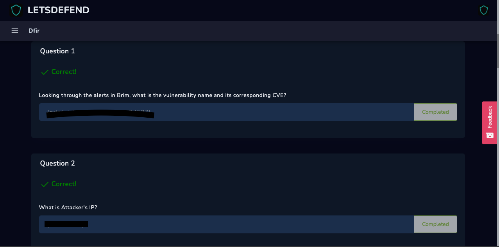
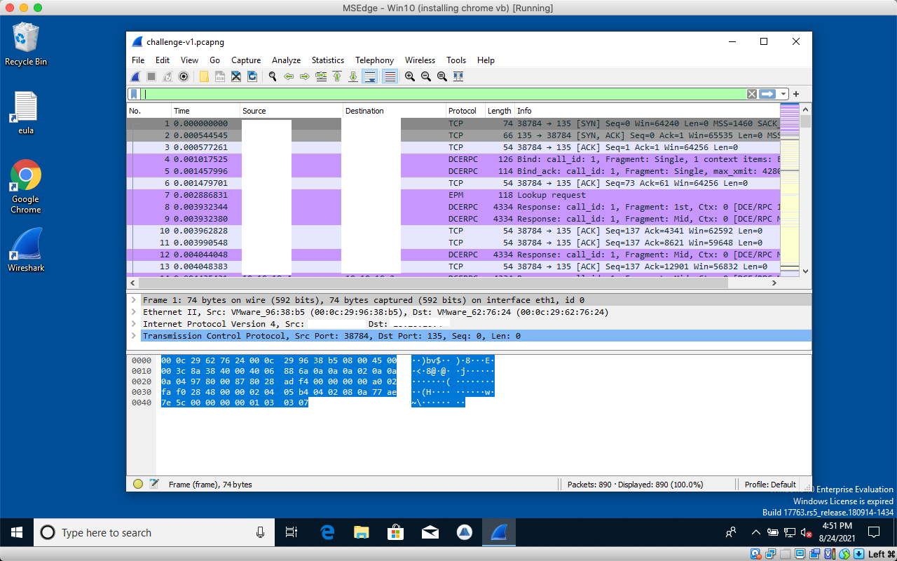

# 1st/2nd Questions

## First

For the sake of this write-up ill be posting 2 questions per page. The images will show that the answers are correct and I'll be posting how to get them without showing the answers.

First question asks us to find the CVE in Brim. I however, wasn't able to install Brim, but I was able to find the answer reading the suricata.rules file in the .zip

### Second&#x20;

For the second question load up the .pcapng file into wireshark and the answer is pretty obvious.

