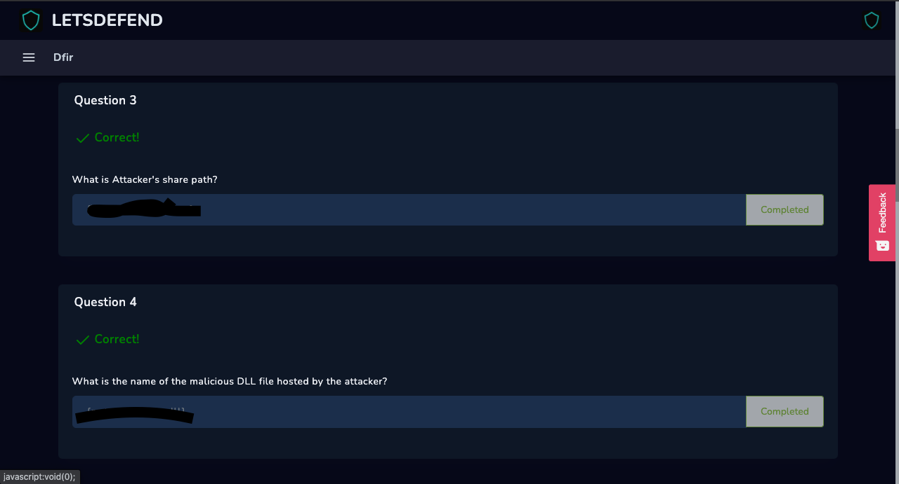
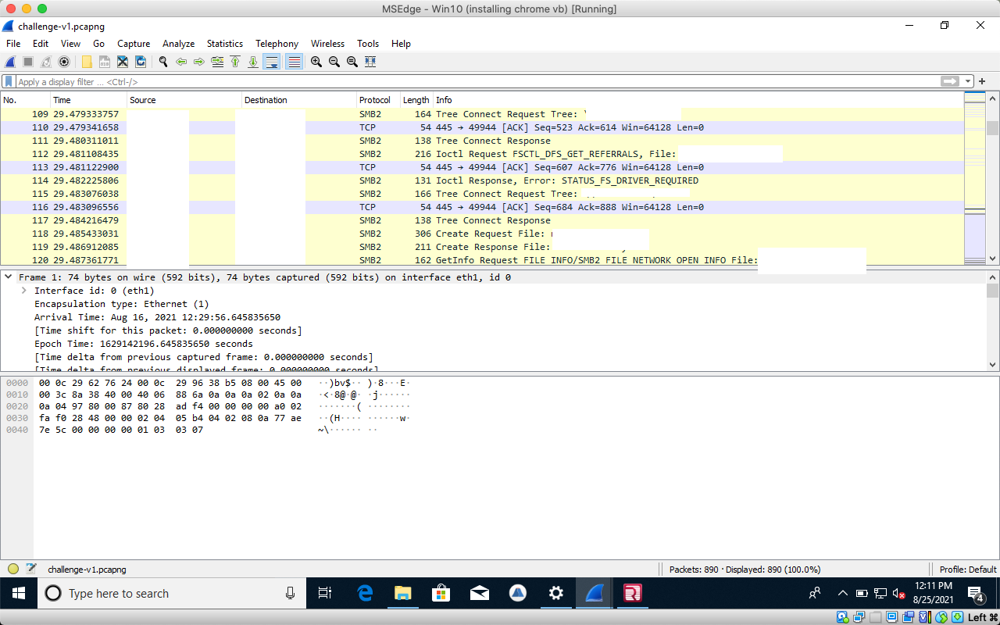

# 3rd/4th Questions

### Third

The hacker share path can also be found in WireShark.&#x20;

### Fourth

The same process applies to this question as well. The answer is located on the right hand side. of WireShark

These problems were relatively easy. But the upcoming paths were becoming much more difficult. What I learned so far was the implementation of WireShark and how to read the path that was being shared between the hacker and the user.
