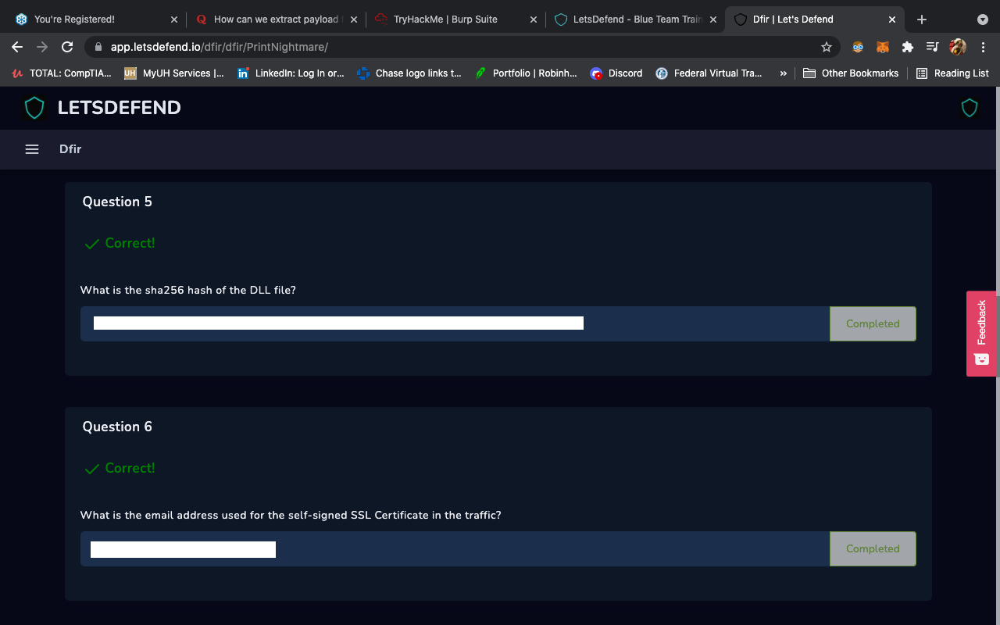
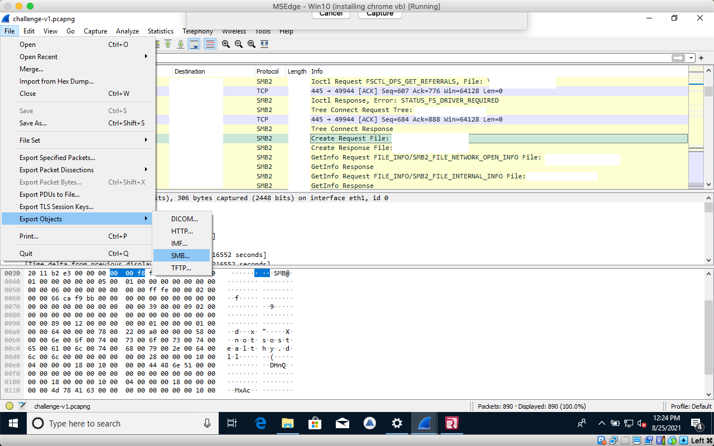
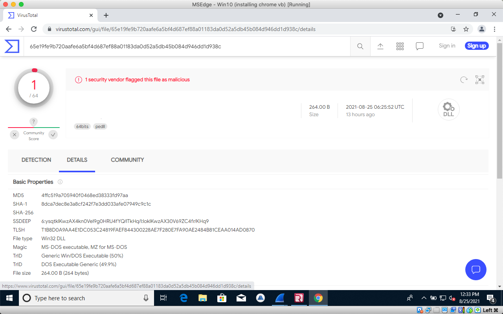
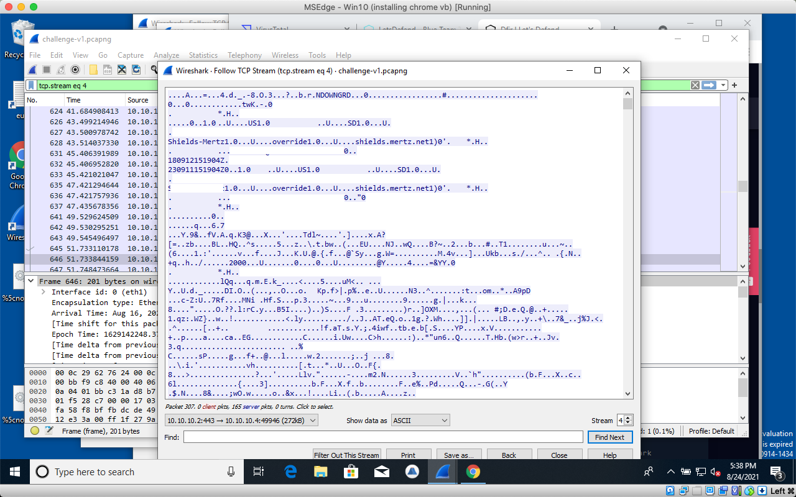

# 5th/6th Question

### Fifth

For the fifth question, we use Wireshark again. But in order to do it correctly, you must find the correct answer to #4.

After finding the right packet you must export is as an object to your desktop.

Once uploaded to the desktop the next step is to find the hash. The way to do that is through VirusTotal.

Input the right SHA-256 hash. The right object will basically _**SCREAM**_ at you.

### Sixth

Now we go back into WireShark to find the email address associated with the SSL Certificate

