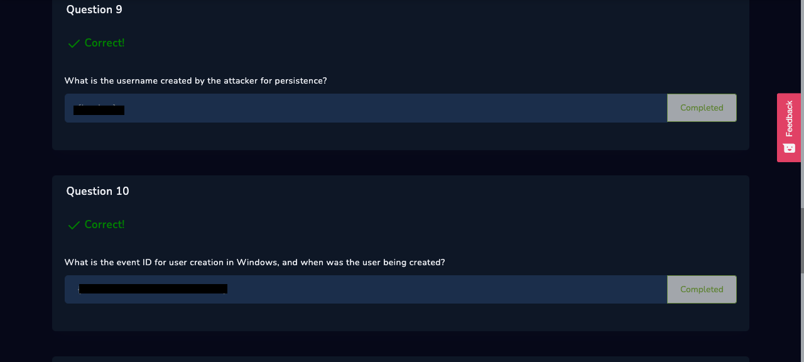
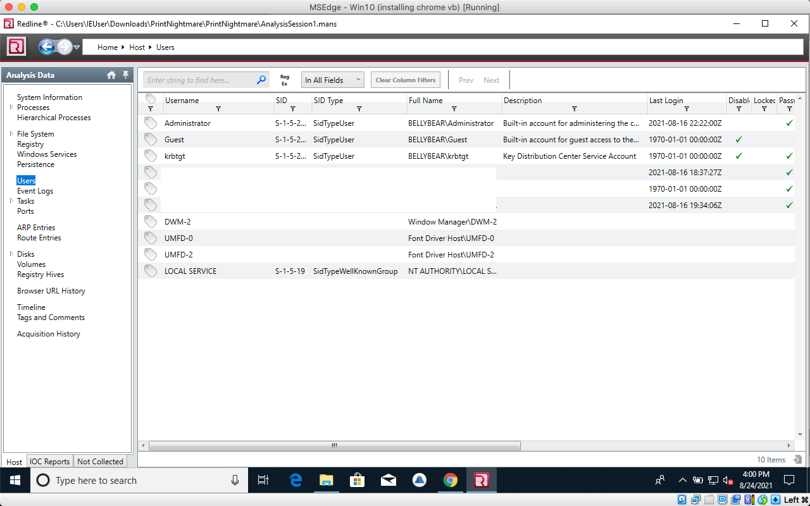
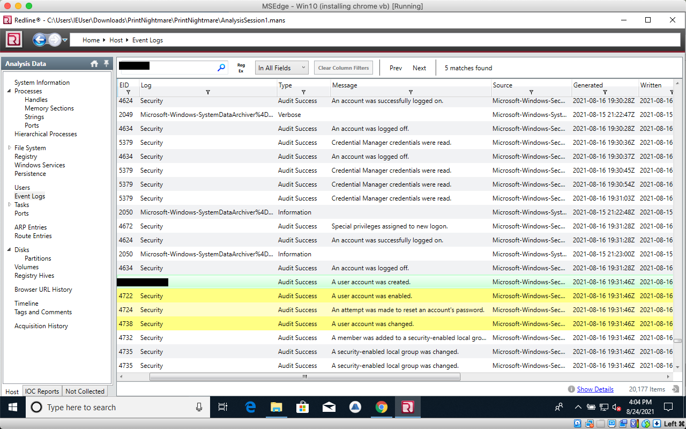

# 9th/10th Questions

### Ninth

You can also find the answer to the ninth question in this photo

### Tenth

We find the answer to the tenth question under the event logs tab. This helps define when the user was created, and the eventID its under so we can find it conveniently in the future.

