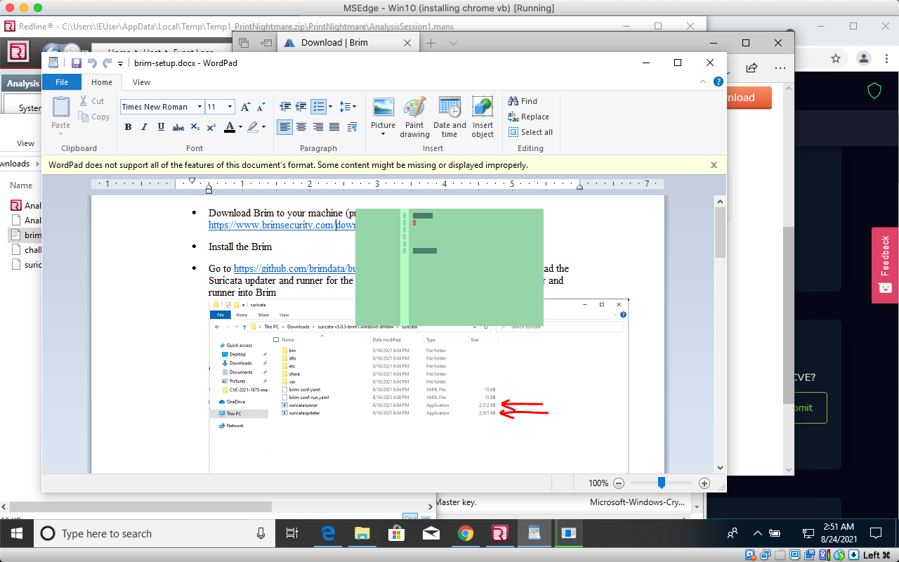

# Gathering Intel

After download the file, and in putting the password to access these files, we unzip the folder and we are given these tools.

.png>)


Prior to this. I had downloaded Redline from Fireeye to open up the Analysis.man file


Next we download Brim.

However, I wasn't able to install it correctly so this error came up.

I troubleshooted with Bohan and he sent me a link to watch&#x20;

However, Brim is not needed to solve the first question with. Brim is a tool to make it easier, but not a necessity.

After gathering all the tools, we dive into our investigation!

&#x20;
