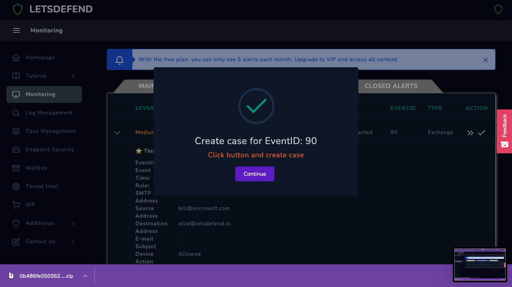
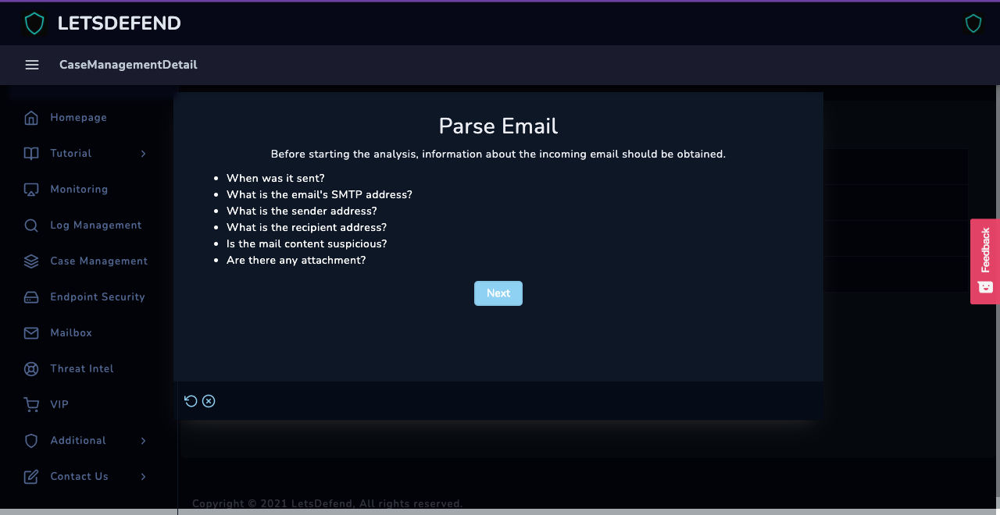
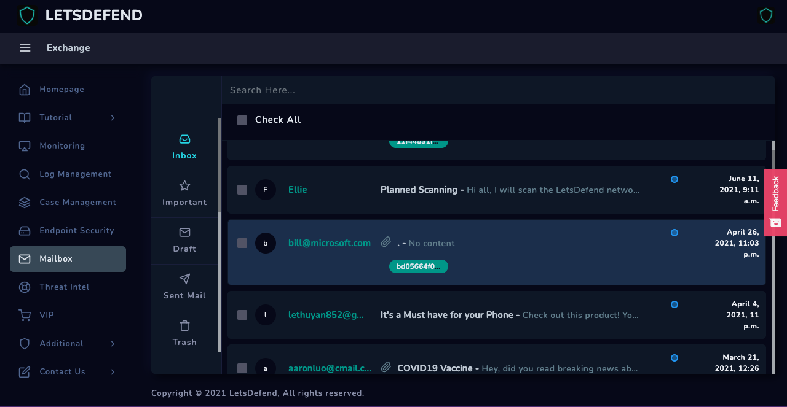
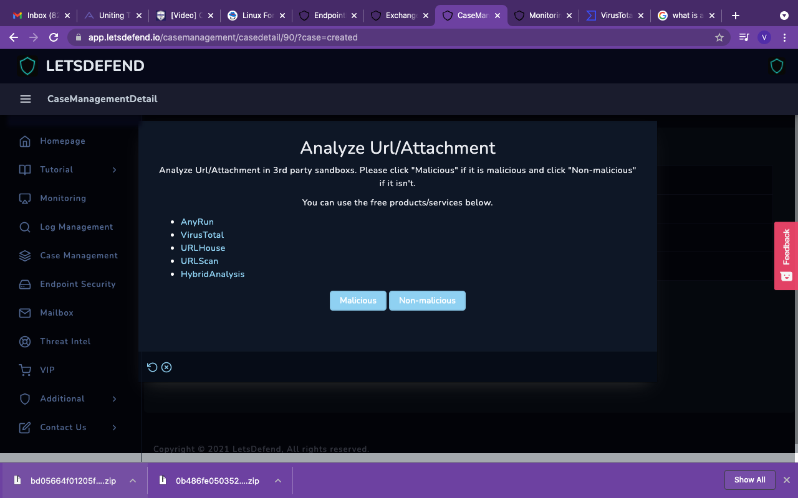
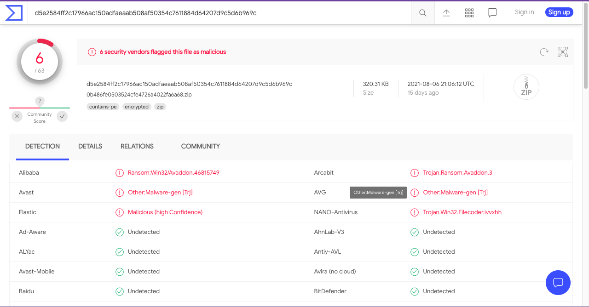
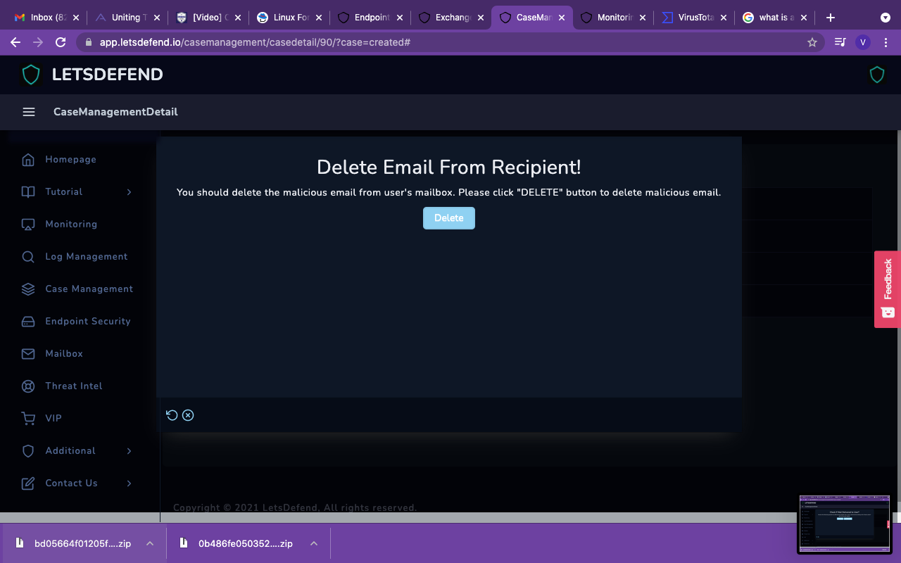
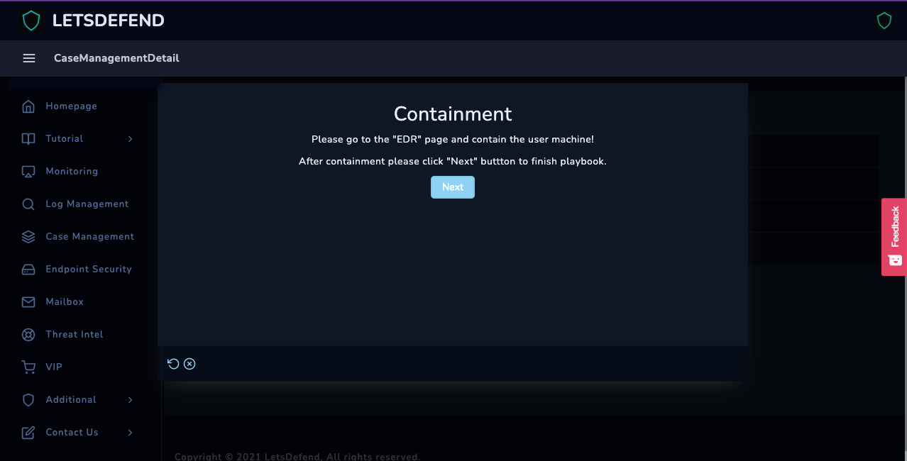
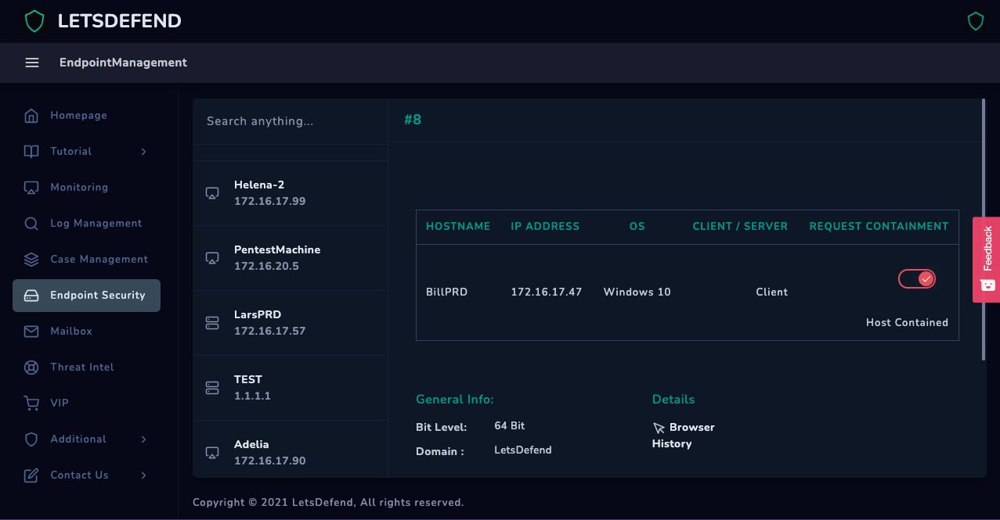
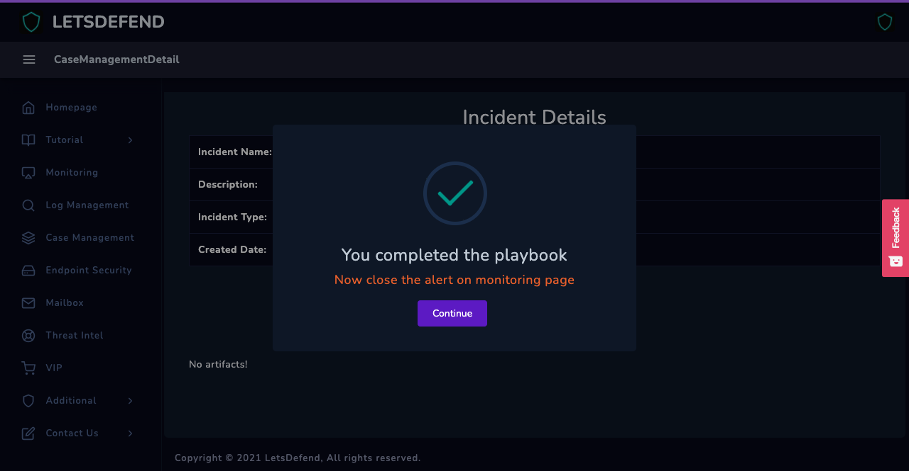
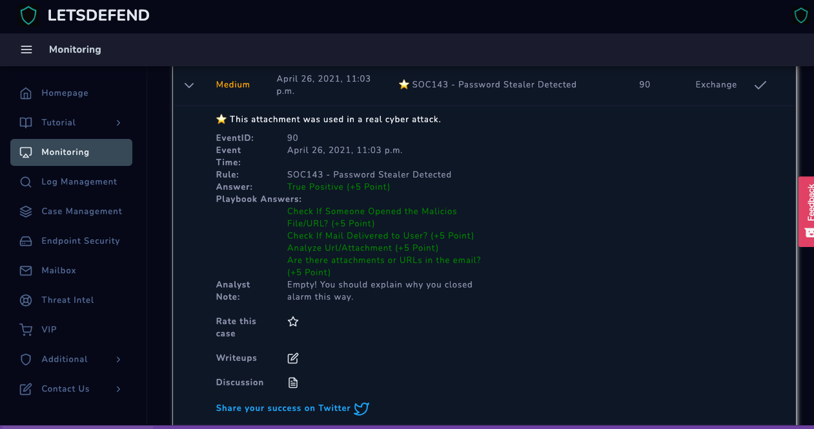

# SOC143 - Password Stealer Detected

## Capturing and Parsing Data

Lets get straight to the point shall we.

.png>)

_( \* next to the the name indicate this attachment was actually used in a real life cyber attack)_

&#x20;Our next window prompts us what we should take into account.

These questions are important to ask yourself when deciphering potential threats to you and your organization. Placing yourself into that mindset early on can not only save you time, but also prepare yourself to have an effective and clear objective into Incident Response and Handling these situations.

### The Process

Once we prepare ourselves with what we should look out for, we begin digging in and dissecting who the sender is, what they had sent, and how it affected the recipient.

.png>)

_(Its important to note when using LetsDefend.io, you should have multiple tabs open)_

We find the source sender and then we go into our mailbox to find what they had sent.

.png>)

After viewing the file, the user bill@microsoft.com has sent a .zip file to our user ellie@letsdefend.io

### Analyzing the Data

The next question requests that we download the zip file and analyze the contents of it.

As you can see we're given 6 Malicious files attached within this .zip file.&#x20;

.png>)

#### Containment and Incident Response Process

The reason for containment is to block the user from doing any more damage. We wouldn't want to leave his user account unchecked. In doing so, we are allowing this user to keep on sending malicious mail to users within our organization.

Completed! The playbook is fairly user friendly once you get used to it. This simple and user friendly interface not only asks players the bigger questions, but it also gets us into the mindset of a SOC Analyst / Incident Responder/Handler as well.

Another one for the books Watson.

